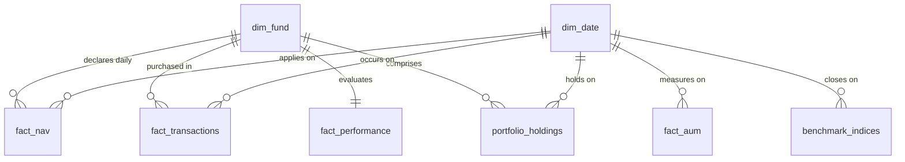

# Data Dictionary — Mutual Fund Capstone Database

This document catalogs the SQLite database (`bluestock_mf.db`) structure. It details the dimensions, fact tables, column types, descriptions, relationships, and source references.

---

## Star Schema Overview

---

## Dimension Tables

### Table: `dim_fund`
*   **Description**: Contains basic static parameters of the 40 mutual fund schemes in the system.
*   **Source Reference**: `01_fund_master.csv`

| Column | SQL Type | PK/FK | Nullability | Business Definition |
| :--- | :--- | :---: | :---: | :--- |
| `amfi_code` | INTEGER | PK | NOT NULL | 6-digit unique Association of Mutual Funds in India (AMFI) code. |
| `fund_house` | TEXT | - | NOT NULL | Name of the Asset Management Company (AMC). |
| `scheme_name` | TEXT | - | NOT NULL | Formal name of the mutual fund scheme. |
| `category` | TEXT | - | NOT NULL | Top-level asset class (e.g., Equity, Debt). |
| `sub_category` | TEXT | - | NOT NULL | Specific investment style (e.g., Large Cap, Small Cap, Gilt, Liquid). |
| `plan` | TEXT | - | NOT NULL | Pricing plan type: `Regular` (agent commission) or `Direct` (direct invest). |
| `launch_date` | TEXT | - | NULL | Scheme inception date (YYYY-MM-DD). |
| `benchmark` | TEXT | - | NULL | Name of the benchmark index mapped to evaluate performance. |
| `expense_ratio_pct` | REAL | - | NULL | Annual operating expense fee charged to investors as a percentage of AUM. |
| `exit_load_pct` | REAL | - | NULL | Penalty fee charged if an investor redeems units within a specified duration. |
| `min_sip_amount` | REAL | - | NULL | Minimum required monthly installment for Systematic Investment Plan. |
| `min_lumpsum_amount`| REAL | - | NULL | Minimum required initial single payment amount. |
| `fund_manager` | TEXT | - | NULL | Main portfolio manager directing the scheme investments. |
| `risk_category` | TEXT | - | NULL | Declared risk profile (e.g., Low, Moderate, High, Very High). |
| `sebi_category_code`| TEXT | - | NULL | SEBI standard regulatory code for categorization. |

---

### Table: `dim_date`
*   **Description**: Conformed calendar dimension lookup table for slicing metrics by time.
*   **Source Reference**: Generated dynamically using Pandas `date_range` based on the span of dates in all tables.

| Column | SQL Type | PK/FK | Nullability | Business Definition |
| :--- | :--- | :---: | :---: | :--- |
| `date` | TEXT | PK | NOT NULL | Calendar date key in YYYY-MM-DD format. |
| `year` | INTEGER | - | NOT NULL | Calendar year (e.g., 2024). |
| `month` | INTEGER | - | NOT NULL | Numeric calendar month (1 to 12). |
| `month_name` | TEXT | - | NOT NULL | Full name of the calendar month (e.g., January). |
| `quarter` | INTEGER | - | NOT NULL | Calendar quarter (1 to 4). |
| `day` | INTEGER | - | NOT NULL | Day of the month (1 to 31). |
| `day_of_week` | INTEGER | - | NOT NULL | Numeric weekday indicator: 0 (Monday) to 6 (Sunday). |
| `day_name` | TEXT | - | NOT NULL | Name of the day (e.g., Monday). |
| `is_weekend` | INTEGER | - | NOT NULL | Boolean flag: 1 = Weekend (Sat/Sun), 0 = Weekday. |

---

## Fact Tables

### Table: `fact_nav`
*   **Description**: Daily Net Asset Value (NAV) records, including weekends and holidays (reindexed & forward-filled).
*   **Source Reference**: `02_nav_history.csv`

| Column | SQL Type | PK/FK | Nullability | Business Definition |
| :--- | :--- | :---: | :---: | :--- |
| `amfi_code` | INTEGER | PK, FK | NOT NULL | Reference to `dim_fund.amfi_code`. |
| `date` | TEXT | PK, FK | NOT NULL | Reference to `dim_date.date`. |
| `nav` | REAL | - | NOT NULL | Price of a single unit of the mutual fund on the given date (INR). |

---

### Table: `fact_performance`
*   **Description**: Performance parameters, ratios, and risk ratings for mutual fund schemes.
*   **Source Reference**: `07_scheme_performance.csv`

| Column | SQL Type | PK/FK | Nullability | Business Definition |
| :--- | :--- | :---: | :---: | :--- |
| `amfi_code` | INTEGER | PK, FK | NOT NULL | Reference to `dim_fund.amfi_code`. |
| `scheme_name` | TEXT | - | NULL | Name of the scheme. |
| `fund_house` | TEXT | - | NULL | AMC Name. |
| `category` | TEXT | - | NULL | Top-level category. |
| `plan` | TEXT | - | NULL | Pricing plan (`Regular`/`Direct`). |
| `return_1yr_pct` | REAL | - | NULL | Annualized return over the last 1 year. |
| `return_3yr_pct` | REAL | - | NULL | Annualized return over the last 3 years. |
| `return_5yr_pct` | REAL | - | NULL | Annualized return over the last 5 years. |
| `benchmark_3yr_pct`| REAL | - | NULL | Annualized return of the benchmark index over the last 3 years. |
| `alpha` | REAL | - | NULL | Risk-adjusted excess return relative to the benchmark index (higher is better). |
| `beta` | REAL | - | NULL | Market sensitivity measure. Beta > 1 is more volatile than market. |
| `sharpe_ratio` | REAL | - | NULL | Return earned per unit of total risk (standard deviation). |
| `sortino_ratio` | REAL | - | NULL | Return earned per unit of downside risk (ignores upside volatility). |
| `std_dev_ann_pct` | REAL | - | NULL | Annualized standard deviation representing overall volatility of returns. |
| `max_drawdown_pct` | REAL | - | NULL | Peak-to-trough decline percentage representing maximum historical loss. |
| `aum_crore` | REAL | - | NULL | Scheme assets under management in Crores INR. |
| `expense_ratio_pct`| REAL | - | NULL | Operating expense ratio of the scheme. |
| `morningstar_rating`| INTEGER| - | NULL | Performance rating from 1 (lowest) to 5 (highest) stars. |
| `risk_grade` | TEXT | - | NULL | Morningstar designated risk grade (e.g., High, Moderate, Low). |

---

### Table: `fact_transactions`
*   **Description**: Ingested investor transactional logs.
*   **Source Reference**: `08_investor_transactions.csv`

| Column | SQL Type | PK/FK | Nullability | Business Definition |
| :--- | :--- | :---: | :---: | :--- |
| `transaction_id` | INTEGER | PK | NOT NULL | Autoincrementing transaction primary key. |
| `investor_id` | TEXT | - | NOT NULL | Unique identifier of the retail investor. |
| `transaction_date` | TEXT | FK | NOT NULL | Reference to `dim_date.date` (YYYY-MM-DD). |
| `amfi_code` | INTEGER | FK | NOT NULL | Reference to `dim_fund.amfi_code`. |
| `transaction_type` | TEXT | - | NOT NULL | Type of action: `SIP` (Systematic), `Lumpsum` (Single), `Redemption` (Withdrawal). |
| `amount_inr` | REAL | - | NOT NULL | Transaction value in Indian Rupees (INR). |
| `state` | TEXT | - | NULL | Indian state of residence of the investor. |
| `city` | TEXT | - | NULL | City of residence of the investor. |
| `city_tier` | TEXT | - | NULL | Classification of city based on market size (e.g. `T30` or `B30`). |
| `age_group` | TEXT | - | NULL | Age bracket of the investor (e.g. 18-25, 26-35, 56+). |
| `gender` | TEXT | - | NULL | Gender of the investor. |
| `annual_income_lakh`| REAL | - | NULL | Annual income of the investor in Lakhs INR. |
| `payment_mode` | TEXT | - | NULL | Method of payment (e.g. UPI, Net Banking, Mandate, Cheque). |
| `kyc_status` | TEXT | - | NULL | Customer KYC verification status (`Verified` or `Pending`). |

---

### Table: `fact_aum`
*   **Description**: Historical total Assets Under Management by fund house (AMC).
*   **Source Reference**: `03_aum_by_fund_house.csv`

| Column | SQL Type | PK/FK | Nullability | Business Definition |
| :--- | :--- | :---: | :---: | :--- |
| `aum_id` | INTEGER | PK | NOT NULL | Autoincrementing record primary key. |
| `date` | TEXT | FK | NOT NULL | Reference to `dim_date.date` (reporting date). |
| `fund_house` | TEXT | - | NOT NULL | Name of the fund house. |
| `aum_lakh_crore` | REAL | - | NULL | AUM in Lakh Crores INR. |
| `aum_crore` | REAL | - | NULL | AUM in Crores INR. |
| `num_schemes` | INTEGER | - | NULL | Number of schemes managed by the AMC at the given date. |

---

## Auxiliary Tables

### Table: `monthly_sip_inflows`
*   **Description**: Industry-wide monthly SIP transaction data.
*   **Source Reference**: `04_monthly_sip_inflows.csv`

| Column | SQL Type | PK/FK | Nullability | Business Definition |
| :--- | :--- | :---: | :---: | :--- |
| `month` | TEXT | PK | NOT NULL | Reporting month in YYYY-MM format. |
| `sip_inflow_crore` | REAL | - | NULL | Total SIP cash inflow across the industry in Crores INR. |
| `active_sip_accounts_crore`| REAL| - | NULL | Total active SIP accounts in Crores. |
| `new_sip_accounts_lakh`| REAL | - | NULL | Count of new SIP accounts opened during the month in Lakhs. |
| `sip_aum_lakh_crore`| REAL | - | NULL | Total AUM accumulated via SIPs in Lakh Crores INR. |
| `yoy_growth_pct` | REAL | - | NULL | Year-over-Year growth percentage of SIP inflow (12 months lag). |

---

### Table: `category_inflows`
*   **Description**: Inflow values broken down by investment scheme category.
*   **Source Reference**: `05_category_inflows.csv`

| Column | SQL Type | PK/FK | Nullability | Business Definition |
| :--- | :--- | :---: | :---: | :--- |
| `category_inflow_id`| INTEGER | PK | NOT NULL | Autoincrementing primary key. |
| `month` | TEXT | - | NOT NULL | Calendar month (YYYY-MM). |
| `category` | TEXT | - | NOT NULL | Investment category (e.g. Large Cap, Liquid, Flexi Cap). |
| `net_inflow_crore` | REAL | - | NULL | Net capital inflow (or outflow if negative) in Crores INR. |

---

### Table: `industry_folio_count`
*   **Description**: Industry-wide mutual fund folios.
*   **Source Reference**: `06_industry_folio_count.csv`

| Column | SQL Type | PK/FK | Nullability | Business Definition |
| :--- | :--- | :---: | :---: | :--- |
| `month` | TEXT | PK | NOT NULL | Calendar month (YYYY-MM). |
| `total_folios_crore` | REAL | - | NULL | Total number of investor folios in Crores. |
| `equity_folios_crore`| REAL | - | NULL | Number of equity-oriented folios in Crores. |
| `debt_folios_crore` | REAL | - | NULL | Number of debt-oriented folios in Crores. |
| `hybrid_folios_crore`| REAL | - | NULL | Number of hybrid-oriented folios in Crores. |
| `others_folios_crore`| REAL | - | NULL | Other classification folios (e.g. ETFs) in Crores. |

---

### Table: `portfolio_holdings`
*   **Description**: Stock components inside the portfolios of the mutual fund schemes.
*   **Source Reference**: `09_portfolio_holdings.csv`

| Column | SQL Type | PK/FK | Nullability | Business Definition |
| :--- | :--- | :---: | :---: | :--- |
| `holding_id` | INTEGER | PK | NOT NULL | Autoincrementing holding primary key. |
| `amfi_code` | INTEGER | FK | NOT NULL | Reference to `dim_fund.amfi_code`. |
| `stock_symbol` | TEXT | - | NOT NULL | Exchange ticker symbol of the underlying stock (e.g., HDFCBANK). |
| `stock_name` | TEXT | - | NOT NULL | Full company name of the underlying stock. |
| `sector` | TEXT | - | NOT NULL | Industry sector classification (e.g., Banking, Tech, Pharma). |
| `weight_pct` | REAL | - | NOT NULL | Weight percentage of the stock within the scheme's overall portfolio. |
| `market_value_cr` | REAL | - | NOT NULL | Total valuation of the holding within the scheme in Crores INR. |
| `current_price_inr` | REAL | - | NOT NULL | Trading price of the stock on the portfolio date. |
| `portfolio_date` | TEXT | FK | NOT NULL | Reference to `dim_date.date` corresponding to reporting date. |

---

### Table: `benchmark_indices`
*   **Description**: Daily tracking value for various benchmark indices.
*   **Source Reference**: `10_benchmark_indices.csv`

| Column | SQL Type | PK/FK | Nullability | Business Definition |
| :--- | :--- | :---: | :---: | :--- |
| `benchmark_index_id`| INTEGER | PK | NOT NULL | Autoincrementing primary key. |
| `date` | TEXT | FK | NOT NULL | Reference to `dim_date.date`. |
| `index_name` | TEXT | - | NOT NULL | Name of the index (e.g., NIFTY50, NIFTY 100 TRI). |
| `close_value` | REAL | - | NOT NULL | Closing price of the index on the given date. |
